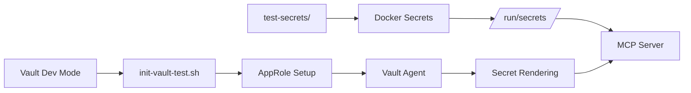

# Configuration Architecture - Post Vault Integration

## 🏗️ Overview

With Vault integration, Typedb-MCP-Server now follows a **Vault-first security architecture** where sensitive data is completely separated from configuration files.

## 📋 Configuration Hierarchy

### 1. **Vault (Secrets Management) - HIGHEST PRIORITY**

- **Purpose**: Manage all sensitive data
- **Contains**:
  - Database passwords (`typedb_password`)
  - JWT signing keys
  - OAuth client secrets
  - TLS private keys
- **Access**: Via AppRole authentication
- **Rendering**: Vault Agent renders secrets to `/vault/secrets/`

### 2. **TOML Config Files - STRUCTURED CONFIGURATION**

- **Purpose**: Application structure and non-sensitive settings
- **Files**:
  - `typedb_mcp_server_config.toml` (default)
  - `config.dev.toml` (development)
  - `config.test.toml` (testing)
- **Contains**: Server settings, endpoints, feature flags

### 3. **Environment Variables (.env) - DEVELOPMENT OVERRIDES**

- **Purpose**: Development-specific overrides and debugging
- **Prefix**: `MCP_` for configuration overrides
- **Contains**:
  - Logging configuration (`RUST_LOG`)
  - Config file paths (`MCP_CONFIG_PATH`)
  - Non-sensitive development settings
- **⚠️ NEVER CONTAINS**: Passwords, tokens, keys, or any secrets

### 4. **Application Defaults - FALLBACK VALUES**

- **Purpose**: Safe defaults when no other configuration is provided
- **Location**: Hardcoded in `src/config.rs`

## 🔐 Secret Management Flow

### Production Environment

```mermaid
graph LR
    A[Vault Server] --> B[AppRole Auth]
    B --> C[Vault Agent]
    C --> D[Secret Templates]
    D --> E[/vault/secrets/db_password.txt]
    E --> F[MCP Server]
```

### Development Environment  



## 📁 File Structure

```markdown
typedb-mcp-server/
├── 🔐 Vault-managed secrets
│   └── /vault/secrets/db_password.txt (rendered by Vault Agent)
│
├── ⚙️ Configuration files
│   ├── typedb_mcp_server_config.toml (default)
│   ├── config.dev.toml (development)
│   ├── config.test.toml (testing)
│   └── config.example.toml (template)
│
├── 🌍 Environment variables
│   ├── .env.example (template)
│   └── .env (local, gitignored)
│
└── 🧪 Development secrets
    └── test-secrets/ (local files for dev)
```

## 🔄 Migration from Legacy .env

### ❌ BEFORE (Legacy .env approach)

```bash
# .env file contained everything
TYPEDB_PASSWORD=secret123
JWT_SECRET=mysecretkey
OAUTH_CLIENT_SECRET=oauth_secret
TYPEDB_ADDRESS=localhost:1729
RUST_LOG=info
```

### ✅ AFTER (Vault-first approach)

**Vault KV Store:**

```bash
# Secrets stored in Vault
vault kv put kv/typedb-mcp-server/config \
  typedb_password="secure_password_from_vault" \
  jwt_secret="cryptographically_secure_key"
```

**.env file (non-sensitive only):**

```bash
# Only non-sensitive configuration
RUST_LOG=debug
MCP_TYPEDB__ADDRESS=localhost:1729
MCP_AUTH__OAUTH_ENABLED=false
```

## 🛠️ Development Setup

### Option 1: Full Vault Integration (Recommended)

```bash
# Use docker-compose with Vault
docker-compose up -d
./scripts/init-vault-test.sh
```

### Option 2: Local Development (Simplified)

```bash
# Set up local secrets
cp test-secrets/typedb_password.txt.example test-secrets/typedb_password.txt
echo "password" > test-secrets/typedb_password.txt

# Use development compose
docker-compose -f docker-compose.yml up -d
```

## 📊 Configuration Precedence

When the same setting is defined in multiple places:

1. **Environment variables** (`MCP_*`) - **HIGHEST**
2. **Config files** (`.toml`)
3. **Application defaults** - **LOWEST**

Example:

```bash
# This environment variable overrides any .toml setting
export MCP_TYPEDB__ADDRESS="production-typedb:1729"
```

## 🚨 Security Best Practices

### ✅ DO

- Store all secrets in Vault
- Use environment variables for non-sensitive overrides
- Keep .env files in .gitignore
- Use example files for onboarding
- Rotate Vault AppRole credentials regularly

### ❌ DON'T  

- Put passwords in .env files
- Commit .env files to git
- Store JWT keys in config files
- Use hardcoded secrets anywhere
- Share AppRole credentials

## 🔍 Troubleshooting

### Common Issues

**1. "TYPEDB_PASSWORD_FILE not found"**

- Vault Agent not running or failing to render secrets
- Check Vault authentication with `vault auth -method=approle`

**2. "Configuration not loading"**

- Check `MCP_CONFIG_PATH` environment variable
- Verify TOML file syntax with `cargo check`

**3. "Environment overrides not working"**

- Ensure correct prefix: `MCP_SECTION__FIELD`
- Check variable names match TOML structure exactly

### Debug Commands

```bash
# Check rendered secrets
ls -la /vault/secrets/

# Verify Vault authentication
vault token lookup

# Test configuration loading
RUST_LOG=debug ./target/debug/typedb_mcp_server
```

## 📚 Related Documentation

- [Vault Setup Guide](test-secrets/README.md)
- [Security Audit Results](SECURITY_AUDIT_RESULTS.md)
- [Docker Compose Configuration](docker-compose.yml)
- [Integration Tests](tests/integration/)
