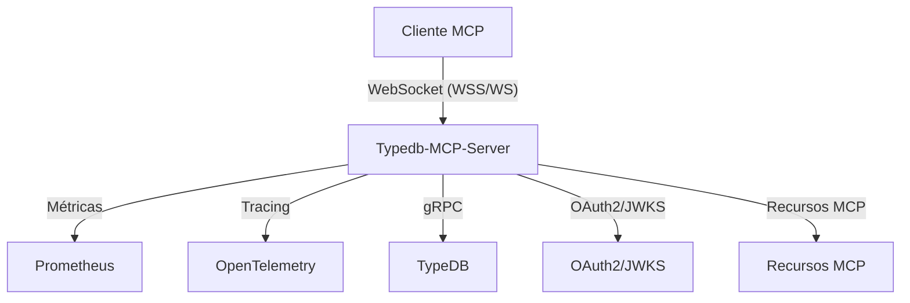

# Arquitetura do Typedb-MCP-Server

## Visão Geral

O Typedb-MCP-Server é um servidor Rust de alta performance, seguro e extensível, projetado para atuar como um gateway MCP (Model Context Protocol) para o banco de dados TypeDB. Ele expõe endpoints WebSocket (MCP), HTTP REST para métricas Prometheus, e integra autenticação OAuth2, tracing distribuído (OpenTelemetry) e métricas detalhadas.

## Componentes Principais

### 1. Binário Principal (`src/main.rs`)

- **Responsável por:**
  - Inicializar o runtime Tokio e o servidor Axum.
  - Carregar configurações (TOML/env).
  - Configurar logging/tracing (tracing-subscriber, OpenTelemetry).
  - Inicializar métricas Prometheus.
  - Conectar ao TypeDB.
  - Instanciar o handler MCP (`McpServiceHandler`).
  - Montar o roteamento Axum para endpoints MCP, métricas, liveness/readiness.
  - Gerenciar TLS (via axum-server + rustls) e shutdown gracioso.

### 2. Biblioteca Central (`src/lib.rs`)

- **Responsável por:**
  - Expor todos os módulos centrais do servidor como biblioteca reutilizável.
  - Modularização clara: config, db, error, mcp_service_handler, auth, metrics, telemetry, resources, tools, transport.

### 3. Configuração (`src/config.rs`)

- **Responsável por:**
  - Estruturas de configuração fortemente tipadas (Settings, TypeDB, Server, OAuth, Logging, etc).
  - Carregamento e merge de TOML/env.
  - Defaults seguros e documentação embutida.

### 4. Autenticação OAuth2 (`src/auth.rs`)

- **Responsável por:**
  - Middleware Axum para validação de JWT Bearer.
  - Cache e refresh automático de JWKS.
  - Validação de escopos, issuer, audience.
  - Propagação de contexto de autenticação para handlers MCP.

### 5. Handler MCP (`src/mcp_service_handler.rs`)

- **Responsável por:**
  - Implementação do trait `ServerHandler` do RMCP.
  - Registro e despacho de ferramentas MCP (query, schema, admin, utilitários).
  - Controle de escopos OAuth2 por ferramenta.
  - Exposição de recursos MCP estáticos e dinâmicos.

### 6. Métricas (`src/metrics.rs`)

- **Responsável por:**
  - Definição e registro de todas as métricas Prometheus.
  - Exposição via endpoint HTTP dedicado.

### 7. Tracing/Observabilidade (`src/telemetry.rs`)

- **Responsável por:**
  - Configuração do pipeline OpenTelemetry.
  - Integração com tracing-subscriber.
  - Exportação para OTLP.

### 8. Ferramentas MCP (`src/tools/`)

- **Responsável por:**
  - Implementação modular de cada categoria de ferramenta MCP (query, schema_ops, db_admin, etc).
  - Parâmetros fortemente tipados para cada operação.

### 9. Transporte (`src/transport.rs`)

- **Responsável por:**
  - Adaptação entre WebSocket Axum e o protocolo MCP.

### 10. Recursos (`src/resources.rs`)

- **Responsável por:**
  - Exposição de recursos estáticos e dinâmicos via MCP.

## Fluxo de Inicialização

1. Carregamento de variáveis de ambiente e arquivos de configuração.
2. Inicialização do logging/tracing.
3. Inicialização das métricas Prometheus.
4. Conexão com TypeDB.
5. Inicialização do JWKS cache (se OAuth2 habilitado).
6. Instanciação do handler MCP.
7. Montagem dos routers Axum (MCP, métricas, healthchecks).
8. Inicialização do servidor HTTP/HTTPS (Axum/Axum-server).

## Segurança

- TLS obrigatório para produção (via Rustls).
- Autenticação OAuth2/JWT opcional, mas recomendada.
- Controle de escopos por ferramenta MCP.
- Configuração sensível nunca persistida em arquivos versionados.

## Observabilidade

- Tracing distribuído via OpenTelemetry (OTLP).
- Métricas detalhadas via Prometheus.
- Endpoints de healthcheck (`/health`, `/readyz`).

## Extensibilidade

- Novas ferramentas MCP podem ser adicionadas em `src/tools/` e registradas no `McpServiceHandler`.
- Configuração modular e validada.

## Diagrama de Alto Nível

---

*Gerado automaticamente a partir do código-fonte em 16/05/2025. Consulte os módulos para detalhes de implementação.*
