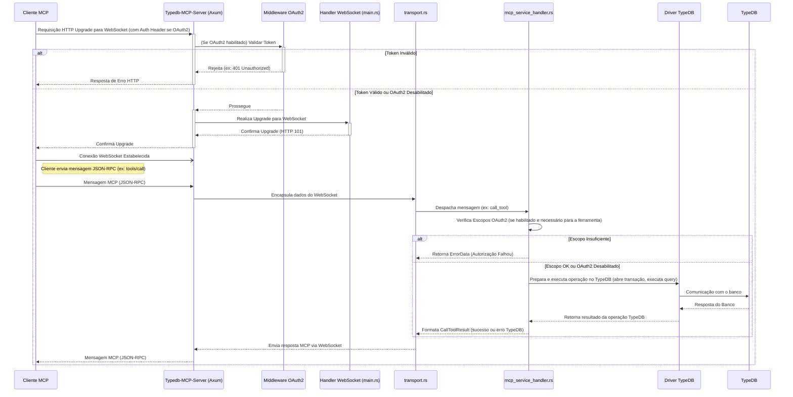

# Guia do Desenvolvedor: Mergulho Profundo na Arquitetura

Este documento expande a [Visão Geral da Arquitetura](../architecture.md), fornecendo um olhar mais detalhado sobre os componentes internos do Typedb-MCP-Server, seus fluxos de interação e as principais decisões de design.

## Revisão dos Componentes Principais

Conforme descrito na visão geral da arquitetura, os componentes centrais são:

1. **Ponto de Entrada e Servidor Web (`src/main.rs`, Axum):** Inicializa e gerencia o servidor HTTP/WebSocket.
2. **Biblioteca Principal (`src/lib.rs`):** Estrutura modular da lógica do servidor.
3. **Configuração (`src/config.rs`):** Carregamento e gerenciamento de configurações.
4. **Conexão com TypeDB (`src/db.rs`):** Interface com o driver TypeDB.
5. **Tratamento de Erros (`src/error.rs`):** Definição e conversão de erros.
6. **Handler do Serviço MCP (`src/mcp_service_handler.rs`):** Implementação do `ServerHandler` do `rmcp`, lógica de despacho de ferramentas.
7. **Autenticação (`src/auth.rs`):** Middleware OAuth2/JWT.
8. **Métricas (`src/metrics.rs`):** Coleta e exposição de métricas Prometheus.
9. **Telemetria (`src/telemetry.rs`):** Configuração de tracing OpenTelemetry.
10. **Recursos MCP (`src/resources.rs`):** Gerenciamento de recursos estáticos e dinâmicos.
11. **Transporte MCP (`src/transport.rs`):** Adaptação WebSocket para o protocolo MCP.
12. **Ferramentas MCP (`src/tools/*`):** Implementação modular de cada ferramenta.

## Fluxo de Inicialização Detalhado

A inicialização do servidor segue uma sequência específica para garantir que todos os componentes estejam prontos antes de aceitar conexões:

1. **Carregamento de Configuração (`Settings::new()` em `src/config.rs`):**
    * Lê variáveis de ambiente (prefixo `MCP_`).
    * Tenta carregar o arquivo TOML especificado por `MCP_CONFIG_PATH` ou o padrão (`typedb_mcp_server_config.toml`).
    * Valores de ambiente sobrescrevem os do arquivo TOML, que por sua vez sobrescrevem os defaults codificados.
    * O resultado é uma struct `Settings` fortemente tipada.

2. **Setup de Logging e Tracing (`setup_logging_and_tracing` em `src/main.rs`):**
    * Configura o `EnvFilter` com base em `settings.logging.rust_log` ou `RUST_LOG`.
    * Inicializa o pipeline OpenTelemetry se `settings.tracing.enabled` for `true`, configurando o exportador OTLP (via `src/telemetry.rs`).
    * Registra o subscriber `tracing` global.

3. **Setup de Métricas (`setup_metrics` em `src/main.rs`):**
    * Registra as descrições de todas as métricas customizadas (via `src/metrics.rs::register_metrics_descriptions`).
    * Inicia um servidor HTTP em `settings.server.metrics_bind_address` para expor o endpoint `/metrics` (path configurável).

4. **Conexão com TypeDB (`db::connect` em `src/db.rs`):**
    * Utiliza `settings.typedb` (address, username, tls_enabled, tls_ca_path) e a variável de ambiente `TYPEDB_PASSWORD`.
    * Estabelece a conexão com o servidor TypeDB usando o `typedb_driver`.
    * Em caso de falha, o servidor encerra, pois é uma dependência crítica.

5. **Inicialização do Cache JWKS (se OAuth2 habilitado):**
    * Se `settings.oauth.enabled` for `true`:
        * Um `JwksCache` (de `src/auth.rs`) é instanciado.
        * É feita uma tentativa inicial de buscar as chaves do `jwks_uri`. Falhas aqui são logadas como aviso, e o cache tentará recarregar em background.
        * O `JwksCache` é compartilhado com o middleware de autenticação.

6. **Instanciação do Handler MCP (`McpServiceHandler::new` em `src/mcp_service_handler.rs`):**
    * Recebe a conexão com o TypeDB e as configurações da aplicação.
    * Registra internamente as ferramentas MCP disponíveis e seus requisitos de escopo OAuth2.

7. **Criação do Estado da Aplicação (`AppState` em `src/main.rs`):**
    * Agrupa os componentes compartilhados (handler MCP, settings, driver TypeDB, cache JWKS, token de shutdown global) para serem passados aos handlers Axum.

8. **Configuração do Roteador Axum (`Router::new().route(...)` em `src/main.rs`):**
    * **Endpoint WebSocket MCP:**
        * Localizado em `settings.server.mcp_websocket_path` (padrão `/mcp/ws`).
        * Associado ao `websocket_handler`.
        * Se OAuth2 estiver habilitado, o middleware `oauth_middleware` (de `src/auth.rs`) é aplicado a esta rota para validar tokens JWT antes do upgrade para WebSocket.
    * **Endpoint de Métricas:**
        * Localizado em `settings.server.metrics_path` (padrão `/metrics`).
        * Associado ao `metrics_handler`, que serve as métricas do `PrometheusHandle`.
    * **Endpoints de Health Check:**
        * `livez` (associado a `health_handler`).
        * `/readyz` (associado a `readyz_handler`), que verifica a saúde do TypeDB e JWKS.
    * Outras configurações do Axum: CORS (via `tower_http::cors`), Request ID, Tracing Layer.

9. **Inicialização do Servidor HTTP/HTTPS (Axum/axum-server):**
    * O servidor escuta no `settings.server.bind_address`.
    * Se `settings.server.tls_enabled` for `true`:
        * `axum_server` é usado para servir sobre HTTPS/WSS.
        * Os caminhos para `tls_cert_path` e `tls_key_path` são usados para carregar os certificados.
    * Se `false`, o servidor HTTP/WS padrão do Axum (sobre Hyper) é usado.
    * Um handler de sinal (SIGINT, SIGTERM) é configurado para iniciar o graceful shutdown.

10. **Graceful Shutdown:**
    * Ao receber um sinal de término, o `CancellationToken` global é ativado.
    * O servidor Axum para de aceitar novas conexões e permite que as existentes terminem.
    * O `McpServiceHandler` (via `rmcp::ServiceExt::serve_with_ct`) também respeita o token de cancelamento para suas conexões ativas.
    * A conexão com o TypeDB é fechada explicitamente.
    * O pipeline de tracing OpenTelemetry é desligado.

## Fluxo de uma Requisição MCP (WebSocket)

**Detalhes do Fluxo:**

1. **Conexão WebSocket:** O cliente inicia uma requisição HTTP para upgrade para WebSocket. Se OAuth2 estiver habilitado, o `oauth_middleware` intercepta esta requisição.
2. **Autenticação (OAuth2):**
    * O middleware extrai o token JWT do header `Authorization`.
    * Valida o token contra o JWKS (buscado de `jwks_uri` e cacheado), `issuer`, `audience` e `required_scopes` gerais.
    * Se inválido, a requisição de upgrade é rejeitada.
    * Se válido, o `ClientAuthContext` (com `user_id` e `scopes`) é injetado nas extensões da requisição Axum e a requisição prossegue para o `websocket_handler`.
3. **Upgrade e Manuseio MCP:**
    * O `websocket_handler` completa o upgrade.
    * O `WebSocketTransport` (`src/transport.rs`) adapta o socket WebSocket Axum para as traits `Stream` e `Sink` esperadas por `rmcp`. Ele lida com a serialização/desserialização de mensagens JSON-RPC MCP.
    * O `McpServiceHandler` recebe as mensagens MCP desserializadas.
4. **Despacho de Ferramentas:**
    * Para uma chamada `tools/call`, o `McpServiceHandler` identifica a ferramenta solicitada.
    * **Autorização (Escopo da Ferramenta):** Verifica se o `ClientAuthContext` (se presente) contém os escopos necessários para a ferramenta específica (definidos em `tool_required_scopes` no `McpServiceHandler`). Se não, retorna um erro MCP de autorização.
    * A chamada é delegada à função handler da ferramenta correspondente (em `src/tools/*`).
5. **Interação com TypeDB:**
    * Os handlers de ferramenta usam o `TypeDBDriver` (injetado no `McpServiceHandler`) para interagir com o TypeDB.
    * Isso geralmente envolve abrir uma transação do tipo apropriado (Read, Write, Schema), executar uma ou mais queries TypeQL e, em seguida, commitar ou dar rollback na transação.
    * Erros do `typedb_driver` são capturados e convertidos para `ErrorData` do MCP (via `src/error.rs`).
6. **Resposta ao Cliente:** O resultado da ferramenta (um `CallToolResult` ou `ErrorData`) é serializado pelo `WebSocketTransport` e enviado de volta ao cliente pela conexão WebSocket.

## Gerenciamento de Estado e Concorrência

* **Tokio:** Todas as operações de I/O (rede, interação com TypeDB) são assíncronas e gerenciadas pelo runtime Tokio.
* **Axum:** Lida com múltiplas conexões HTTP/WebSocket concorrentemente. Cada conexão WebSocket é geralmente manuseada em sua própria task Tokio.
* **`Arc` e `Mutex`/`RwLock`:** Dados compartilhados entre tasks (como `Settings`, `TypeDBDriver`, `JwksCache`, `McpServiceHandler`) são envolvidos em `Arc` para contagem de referência. Mutabilidade compartilhada é gerenciada com `Mutex` ou `RwLock` conforme necessário (ex: `JwksCache` usa `RwLock` para seu cache interno).
* **`McpServiceHandler` é `Clone`:** Permite que cada conexão WebSocket tenha sua "instância" lógica do handler, embora os dados subjacentes (como o driver TypeDB e settings) sejam compartilhados via `Arc`.
* **Conexões TypeDB:** O `typedb-driver-rust` gerencia internamente suas conexões e pooling (se aplicável pela versão do driver). O Typedb-MCP-Server trata o `TypeDBDriver` como um recurso compartilhado.

## Extensibilidade

* **Novas Ferramentas MCP:** O design em `src/tools/` e o registro no `McpServiceHandler` (com a macro `#[tool]` e `tool_box!`) visam simplificar a adição de novas ferramentas. Cada ferramenta é encapsulada em seu próprio handler.
* **Novos Módulos:** Funcionalidades adicionais (ex: diferentes mecanismos de autenticação, novos endpoints HTTP) podem ser adicionadas como novos módulos e integradas ao roteador Axum em `main.rs`.

## Considerações de Segurança Adicionais (Nível de Arquitetura)

* **Validação de Entrada:** Os parâmetros das ferramentas MCP são desserializados e validados (implicitamente pela desserialização para structs fortemente tipadas e, se necessário, com validações explícitas nos handlers).
* **Tratamento de Erros:** Erros internos ou do TypeDB são capturados e convertidos para erros MCP padronizados, evitando o vazamento de detalhes excessivos da implementação para o cliente.
* **Separação de Responsabilidades:** Os módulos (`auth`, `db`, `mcp_service_handler`, etc.) têm responsabilidades bem definidas, o que ajuda na manutenção e na análise de segurança.

Este mergulho profundo deve fornecer uma base sólida para entender como o Typedb-MCP-Server funciona internamente. Para detalhes específicos de implementação, consulte os respectivos módulos no código-fonte.
